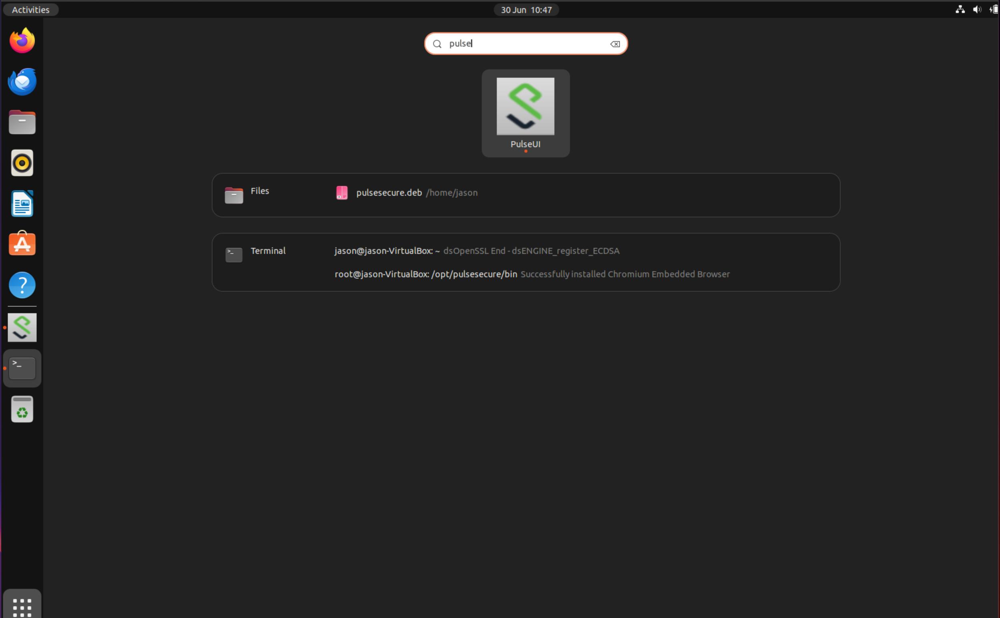
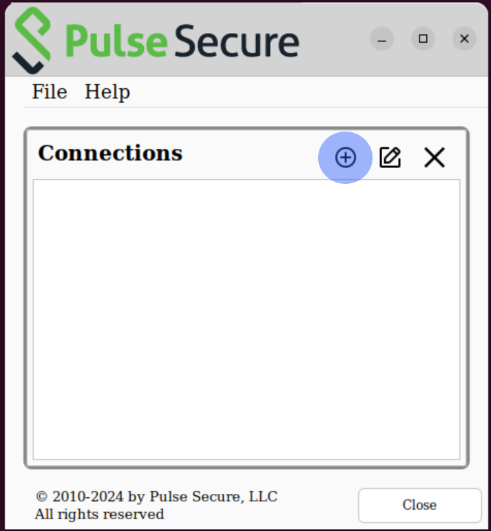
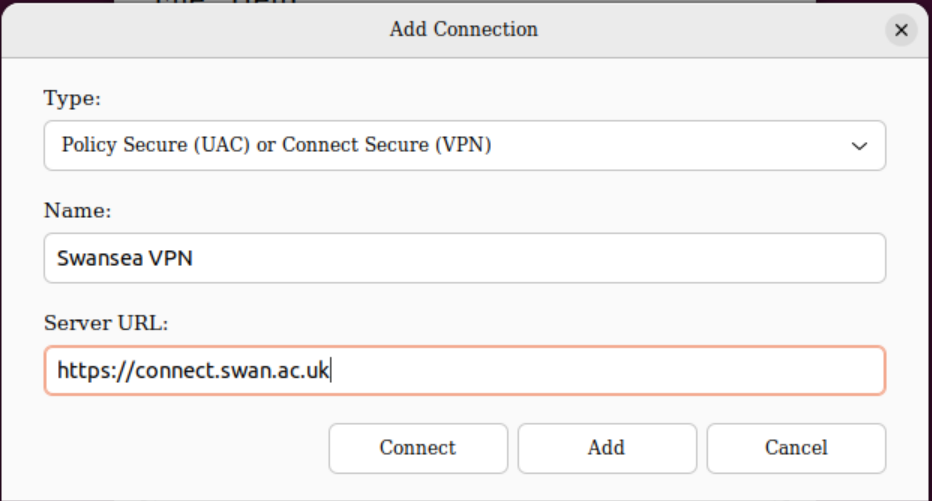
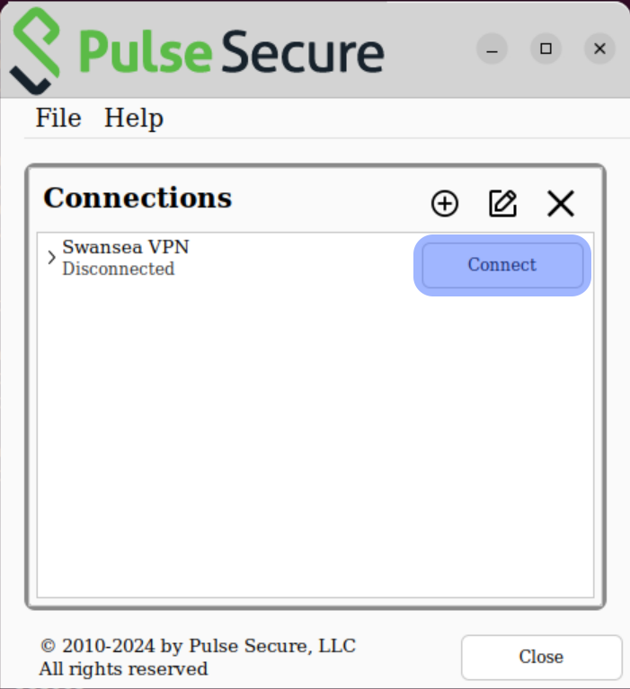
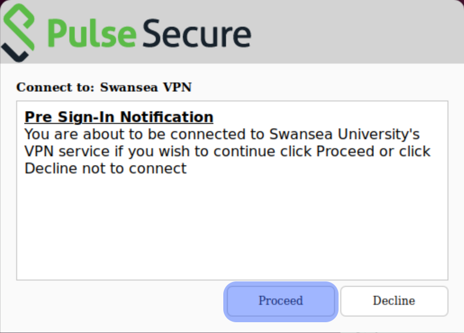
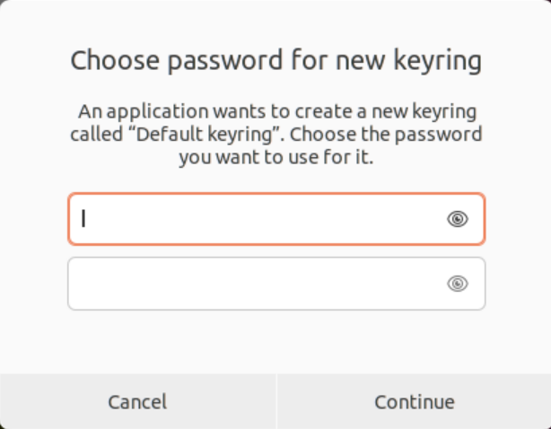
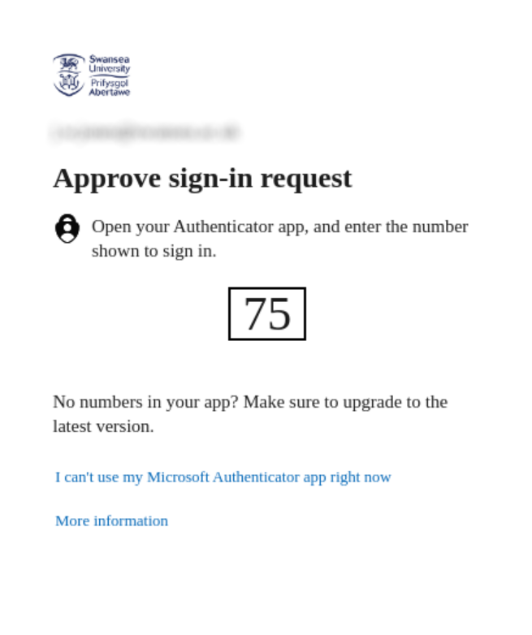
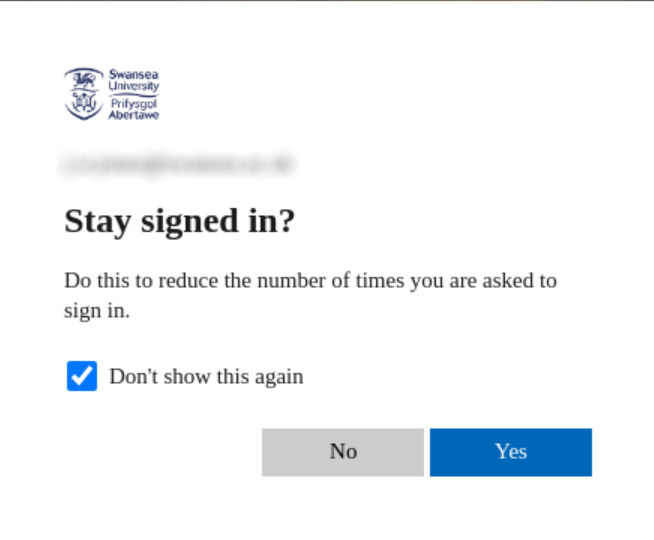

# Setup Swansea VPN On Linux

These steps were performed on a brand new install of Ubuntu 22.04LTS

1. We need to run a bunch of commands as root
```
sudo bash
```

2. PulseSecure has a few pre-requisities that need to be installed
```
apt install libcurl4 libnss3-tools curl
```

3. Download the PulseSecure package
```
wget -O pulsesecure.deb 'https://connect.swan.ac.uk/dana-na/jam/getComponent.cgi?command=get;component=PulseSecure;platform=deb'
```

4. Install the PulseSecure package
```
apt install ./pulsesecure.deb
```
There will be a warning message about the download being performed unsandboxed. Please ginore this.

5. Before running PulseSecure it needs the Chromium Embedded Framework to be installed in order to ask for your MFA credentials. Unfortunately, PulseSecure tries to install this and fails so we need to do it manually.
```
cd /opt/pulsesecure/bin/
./setup_cef.sh install
```

6. Run PulseSecure. Make sure you are not doing this from your sudo prompt - Run it as a normal user. This can be done from the command line using:
```
/opt/pulsesecure/bin/pulseUI
```
Or from the desktop. Open the Application window, enter Pulse in the search box and click on the PulseUI icon.



# Setting up PulseSecure

1. Click on the '+' icon to add a connection.



2. Enter the details shown below (the Name field can be anything you like) then click 'Connect'.



3. To connect to the VPN, click 'Connect'



4. Click 'Proceed'



5. This opens both the login page, where you entry your University username and password, and an Ubuntu window asking foe a password for a new keyring. The keyring is an area in Ubuntu where credentials will be stored. Enter a password of your choosing.




6. The usual 2FA procedure then proceeds.




7. You are now connected!! You can proceed to connect to services protected by the VPN.
