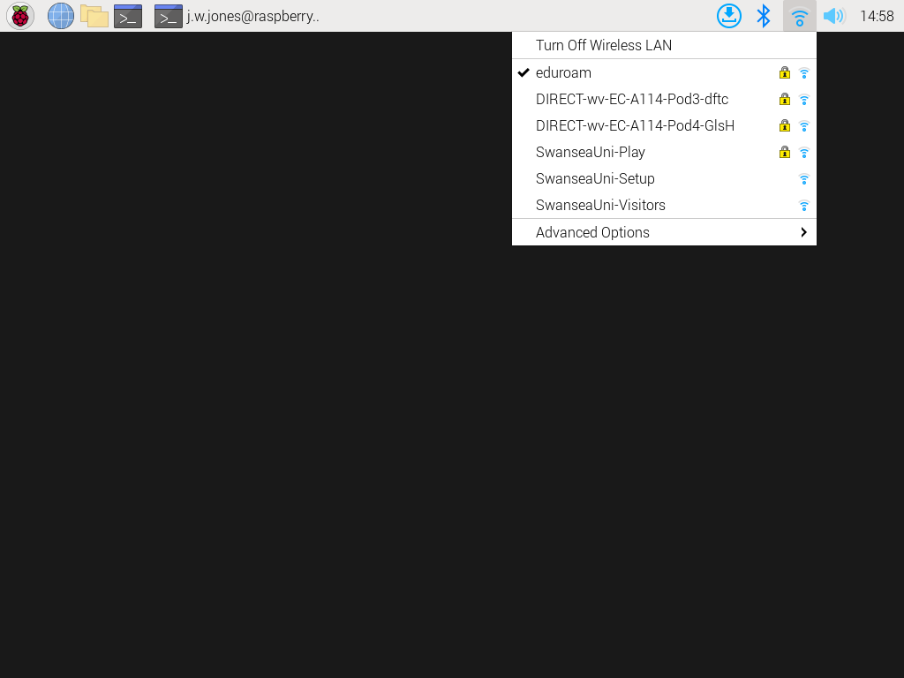
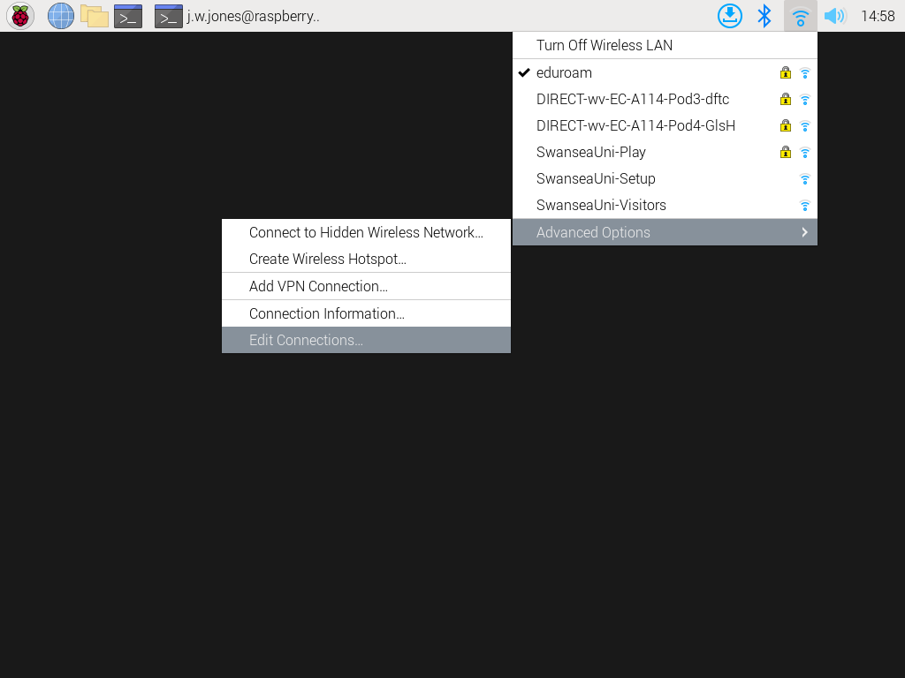
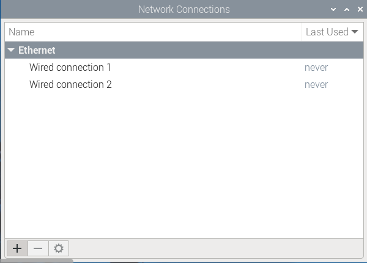
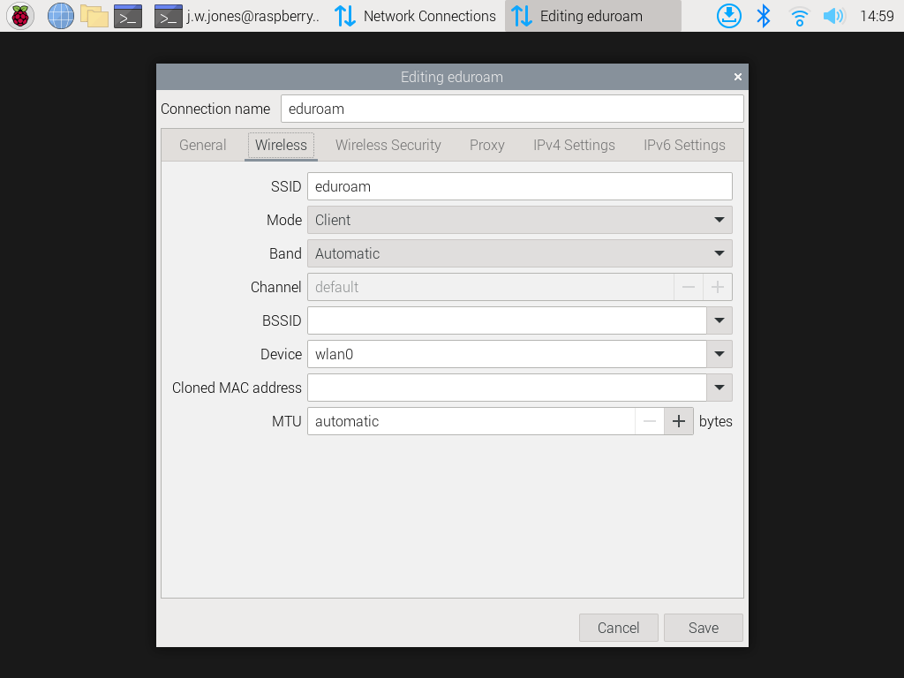
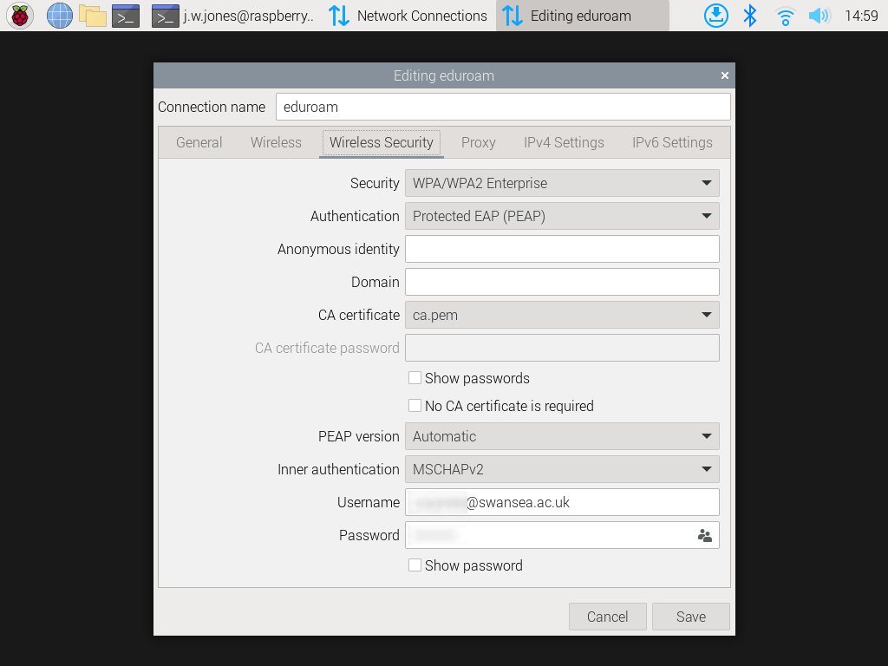
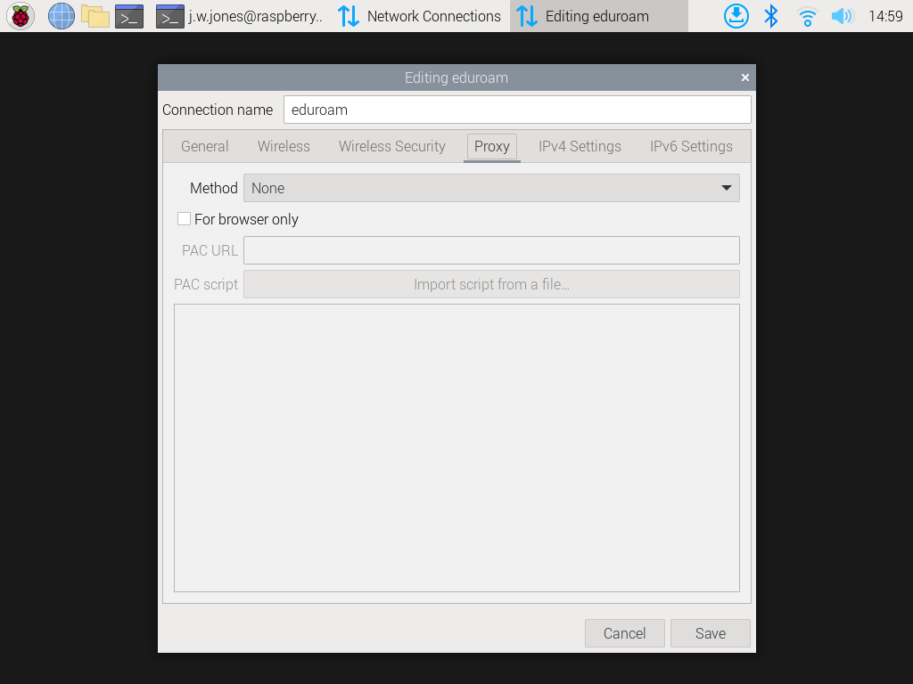
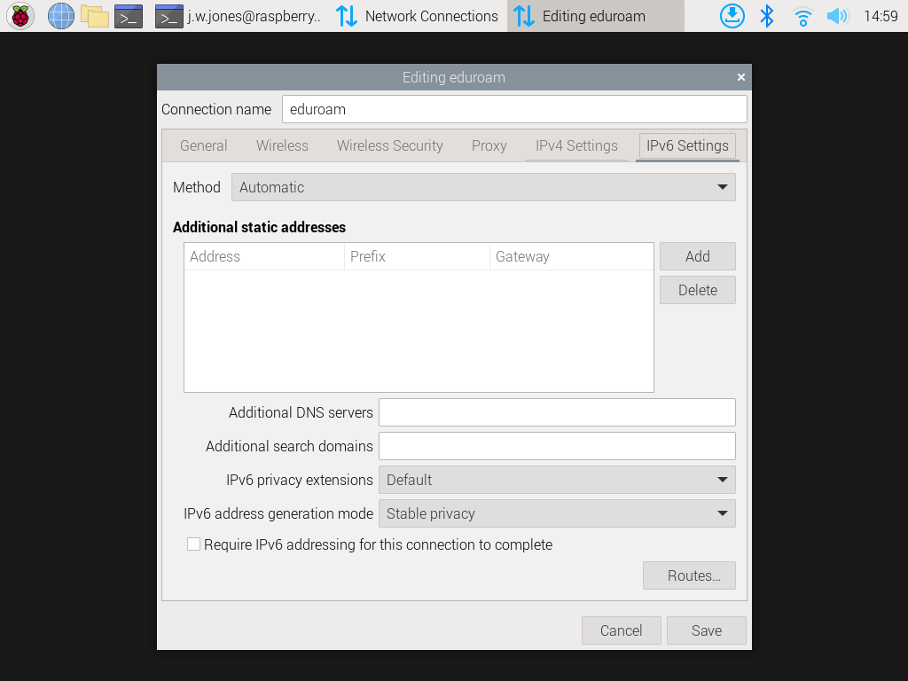

# Setup EduRoam on Raspberry Pi

Follow these steps:

1. Copy the file [ca.pem](./ca.pem) to the `.config` folder in your home folder. (If this folder doesn't exist then create it)
2. Click on the Wi-Fi icon in the top right corner of the desktop. 
3. Select `Advanced Options` 
4. Select `Edit Connections` to open the Network Connections panel 
5. Select the WiFi network and edit to open the Editing panel. The following images show the settings in each tab. In the Wireless Security tab, navigate the "CA certificate' to the file just downloaded `ca.pem`.      
