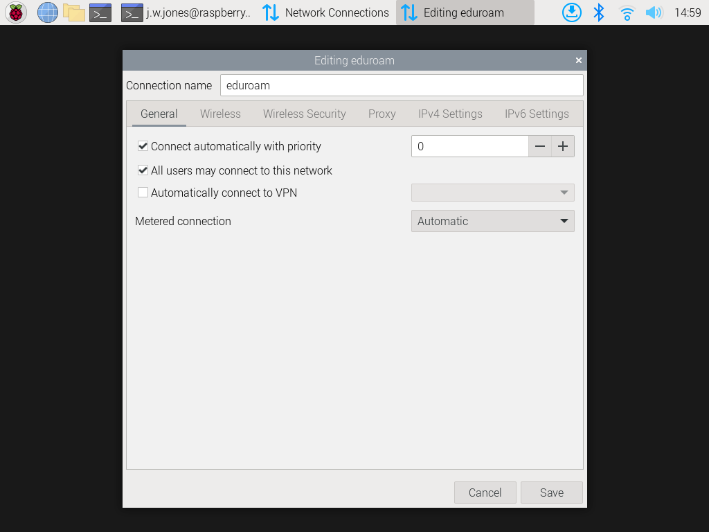
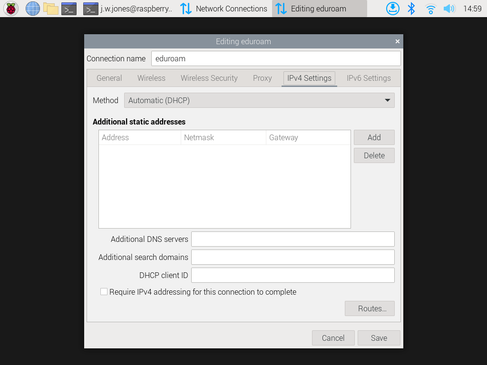

# Setup EduRoam on Raspberry Pi

These steps have been created from a new Pi installation:

1. Copy the file [ca.pem](./ca.pem) to the `.config` folder in your home folder. (If this folder doesn't exist then create it). Since you probably have no network connectivity, copy the file to a USB pen and insert that into the Pi.
2. Click on the Wi-Fi icon in the top right corner of the desktop. 
3. Select "Click here to set Wi-Fi country" 
   
   
4. Choose GB and click 'OK'
5. Reboot the Pi.
6. If you haven't done this already, now is the time to register your MAC address with EduRoam to allow it to connect
    - Open a Console Window and enter the command `ip addr`
    - This will display all your network interfaces.
    - We want the MAC address associated with your wireless interface (probably called `wlan0`). It comprises 6 pairs of hexadecimal numbers (see the red box).
    
      
7. Click on the Wi-Fi icon in the top right corner of the desktop again. 
8. Select `Advanced Options` followed by `Edit Connections` to open the Network Connections panel 
9. Click on the '+' in the bottom left corner to add a new connection.
10. In the "Choose a Connection Type" panel select "Wireless" and then click "Create".
   
   

11. The following images show the settings in each tab. In the Wireless Security tab, navigate the "CA certificate' to the file just downloaded `ca.pem`.      

12. When you click 'Save' the panel will close and the Pi should connect to EduRoam.
